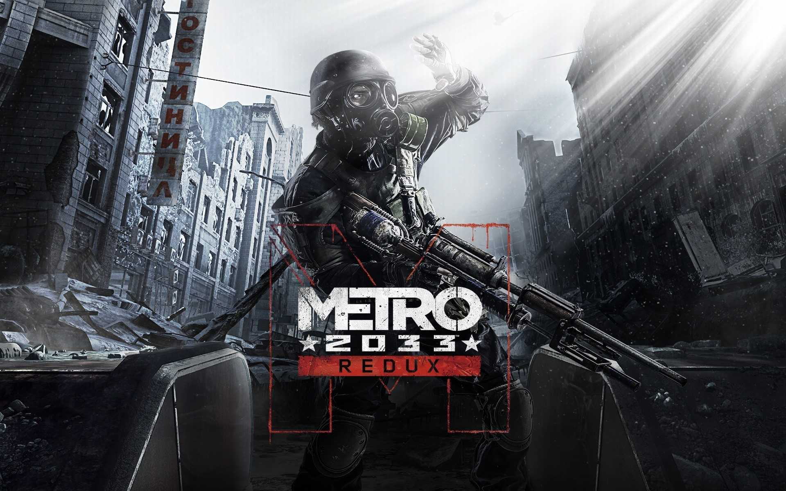
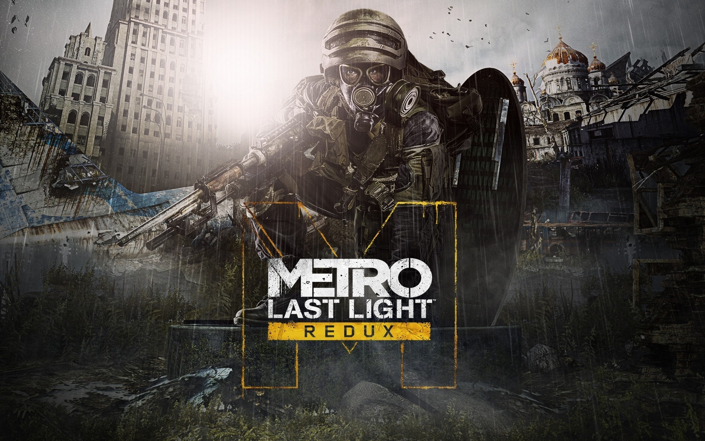
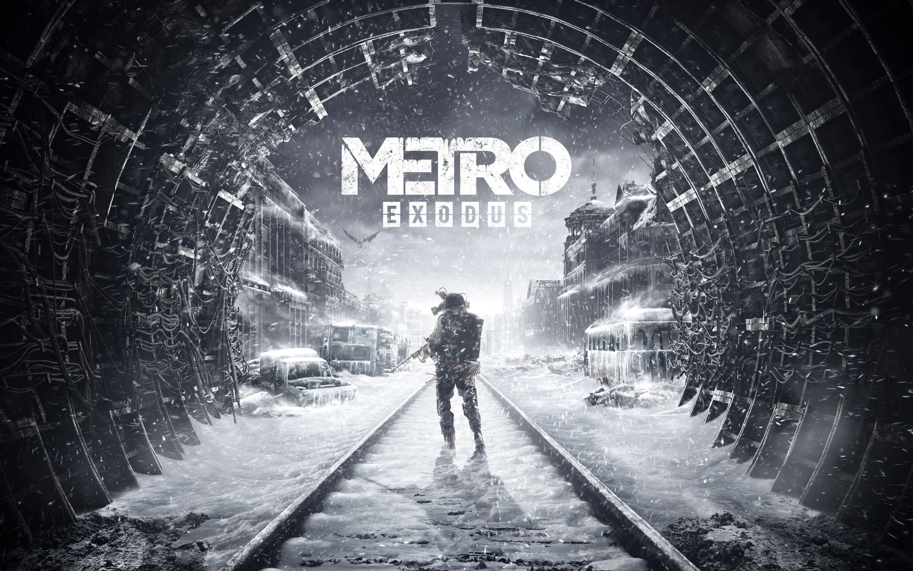

===================
Seria Metro: Opis
===================
   
Część 1: [Metro 2033]
==========================

:alt: Okładka Części 1

-------------

Opis Części 1
-------------
Krótki opis fabuły i atmosfery Części 1 serii Metro.
W Metro 2033 głównym bohaterem jest Artyom / Artem, będący jednym z pierwszych ludzi urodzonych
w moskiewskim metrze, które po wojnie atomowej w 2013 roku stało się schronieniem
dla ocalałej populacji stolicy Rosji. Poszczególne stacje stały się autonomicznymi
państwami-miastami, a powierzchnia niegdyś tętniącej życiem metropolii zamieszkałą przez wynaturzone 
radiacją istoty ruiną. 20-letni bohater wyrusza wraz z członkiem elitarnej organizacji Rangerów, by 
sprawdzić, co zagraża jednej ze stacji, po drodze przedzierając się m.in. przez tereny znajdujące się 
pod kontrolą Sowietów i nazistowskiej Czwartej Rzeszy. 
Z dodatkowych informacji 
Gra została stworzona przez kijowskie studio 4A Games, które na koncie nie ma dotąd żadnego tytułu. 
Nie można jednak powiedzieć, że to zupełny debiutant w kwestii tworzenia gier. 
W załodze 4A Games pracują takie osobistości jak Olesa Szyszkowtsowa czy Aleksandra 
Maksimczuka. Pracowali oni w studio GSC Game World, które było odpowiedzialne m.in. 
za wszystkie części Stalkera. O brak doświadczenia nie możemy się więc martwić.

-------------

Część 2: [Metro Last Light Redux]
=================================

:alt: Okładka Części 2

-------------

Opis Części 2
-------------
Krótki opis fabuły i atmosfery Części 2 serii Metro. Głównym miejscem akcji,
podobnie jak w poprzedniej części, są ciemne i ponure korytarze moskiewskiego
metra. Większość czasu akcji dzieje się głęboko pod ziemią, choć przyjdzie nam 
również wyjść na zewnątrz. Obraz zniszczonego miasta bo bombardowaniu wygląda 
niesamowicie, a odpowiednio dobrana grafika i kolorystyka potęgują nasze wrażenia.

Ciekawostką związaną z produkcją gry "Metro: Last Light Redux" jest fakt, 
że oryginalna gra "Metro: Last Light" była pierwotnie zaplanowana jako tytuł 
o nazwie "Metro 2034", nawiązując do drugiej powieści Dmitrija Głuchowskiego,
która stanowiła kontynuację "Metro 2033". Jednak w trakcie procesu produkcji 
zdecydowano się zmienić nazwę na "Metro: Last Light".
To zmiana wynikła częściowo z faktu, że "Metro 2034" było bardziej zbiorem 
opowiadań niż ciągłą kontynuacją historii Artyoma, 
głównego bohatera "Metro 2033". Twórcy postanowili skupić się na nowej 
opowieści i wprowadzić unikalne elementy, co doprowadziło 
do decyzji o zmianie tytułu.

-------------

Część 3: [Metro Exodus]
==========================

:alt: Okładka Części 3

-------------

Opis Części 3
-------------
Krótki opis fabuły i atmosfery Części 3 
Seria Metro pierwszy raz w historii nie będzie umiejscowiona w trakcie lub 
między opowieściami Dmitrija Glukhovskiego, autora książek, a po tekstach 
znanego pisarza. Głównym bohaterem Metro: Exodus jest nadal Artem, 
a gra będzie bezpośrednią kontynuacją Metro 2035, ale tym razem protagonista 
wyrusza w długą podróż zbierając małą grupę ocalałych i 
opuszcza Moskwę dzięki lokomotywie Aurora. 
ciekawostką związana z produkcją "Metro Exodus" jest inspiracja prawdziwymi 
wydarzeniami i historiami ludzi, które wpłynęły na kształtowanie 
postapokaliptycznego świata przedstawionego w grze.
Dmitrij Głuchowski, autor powieści, na których oparta jest seria "Metro", 
czerpał inspirację z opowieści o rzeczywistych ludziach, którzy 
przetrwali katastrofy nuklearne czy inne klęski natury. 
Podobnie zespół deweloperski konsultował się z ekspertami od katastrof i 
specjalistami ds. przetrwania, aby uzyskać realistyczny obraz tego, 
jak społeczności mogłyby funkcjonować po apokalipsie.
To podejście do korzystania z rzeczywistych historii przetrwania 
i nauki od ludzi, którzy doświadczyli katastrof, miało na celu 
uwiarygodnienie świata gry i stworzenie autentycznego doświadczenia.

